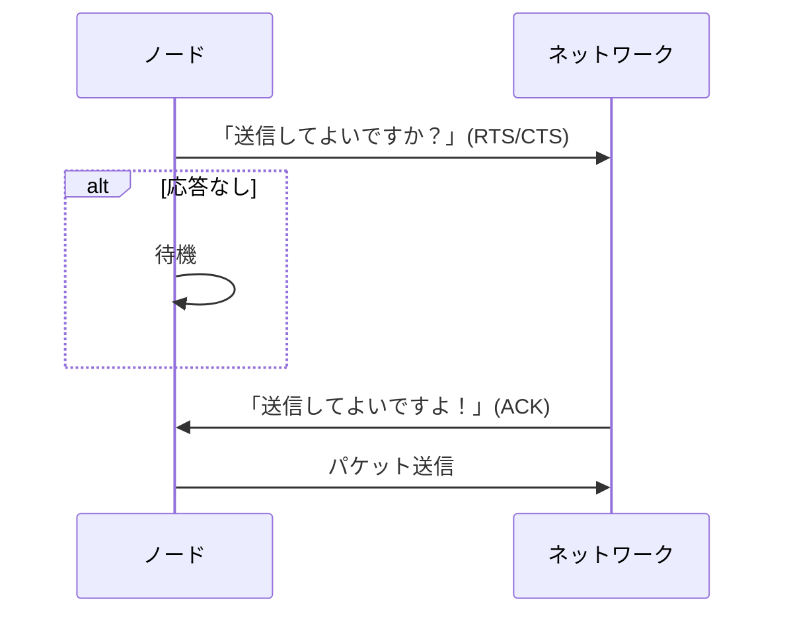

# LAN制御方式・VLAN・ネットワーク装置・ドメイン分割を体系的に整理

## はじめに

2025年10月のプロジェクトマネージャ試験受験を終え、2026年秋の情報処理安全確保支援士に向けて勉強中です。
本記事を含めた各知識のインデックスや学習の道のりについては、「[情報処理安全確保支援士への道のり(随時更新中)](https://qiita.com/teppei19980914/items/a25279a17b210d6ed9f4)」をご参照ください。
**本記事は学習した内容を記載しています。**

## 該当問題

[情報セキュリティスペシャリスト平成21年秋期 午前Ⅱ 問13](https://www.sc-siken.com/kakomon/21_aki/am2_13.html)
[情報セキュリティスペシャリスト平成24年秋期 午前Ⅱ 問17](https://www.sc-siken.com/kakomon/24_aki/am2_17.html)
[情報セキュリティスペシャリスト平成25年秋期 午前Ⅱ 問17](https://www.sc-siken.com/kakomon/25_aki/am2_17.html)
[情報処理安全確保支援士平成31年春期 午前Ⅱ 問12](https://www.sc-siken.com/kakomon/31_haru/am2_12.html)
[情報処理安全確保支援士平成31年春期 午前Ⅱ 問18](https://www.sc-siken.com/kakomon/31_haru/am2_18.html)
[情報処理安全確保支援士令和7年春期 午前Ⅱ 問18](https://www.sc-siken.com/kakomon/07_haru/am2_18.html)

## Ethernet

IEEE 802.3によって標準化された有線LAN規格で、OSI参照モデルの物理層とデータリンク層に対応しています。

### OSI参照モデル

異なるシステム間の通信を標準化するためにISOが策定した7階層モデルです。各階層については下記のとおりです。

|階層番号|名前|主な役割|
|:----|:----|:----|
|7|アプリケーション|利用者アプリに最も近い層|
|6|プレゼンテーション|データ形式変換(暗号/圧縮)|
|5|セッション|通信の開始／維持／終了|
|4|トランスポート|信頼性(TCP)・分割再構成|
|3|ネットワーク|経路選択/IPアドレス|
|2|データリンク|フレーム化/MACアドレス|
|1|物理|電気信号/光信号/ケーブル|

## LANの制御方式

複数端末が同じネットワーク媒体を共有するLAN上では、複数端末が同時に送信することで衝突(コリジョン)が発生してしまいます。そのため、「誰が、いつ、どのように送信するのか」を決める仕組みが必要であり、この仕組みがLANの制御方式(MAC方式(Media Access Control))です。

### 主要なMAC制御方式

* CSMA/CD
* トークンパッシング
* CSMA/CA

### CSMA/CD(Carrier Sense Multiple Access with Collision Detection)

送信前に回線が空いているか(キャリアセンス)を確認し、データを送信します。もし仮に、コリジョンが発生した場合は、再送する方式です。

#### コリジョンの検出

送信中の端末は、自身の送信信号と回線上に流れている信号を比較し、他端末との信号が混じって波形が崩れた場合、衝突の発生と判断します。
**上記検出方法は有線(Ethernet)だからこそ可能ですが、無線LANの場合は不可能なので、CSMA/CAが存在します。**

### トークンパッシング(Token Bus/Token Ring)

「トークン」と呼ばれるネットワーク上の特殊フレームが順番にノードを巡回し、トークンを持ったノードだけが送信できる方式です。トークンを保持しているノードはその瞬間は世界に一つだけなので、同時送信が起こらず衝突が発生しません。

#### メリット

* 衝突ゼロです
* 優先度制御が可能です(トークンの回り方を制御)
* リアルタイム性が要求される産業ネットワークに適します

#### デメリット

* トークンが失われると送信不能になります
* 物理構成・復旧が複雑です
* スイッチEther化で事実上廃れました

### CSMA/CA(Carrier Sense Multiple Access with Collision Avoidance)

有線LANのように衝突を検出できない無線環境で、事前に衝突を避ける(Avoidance)方式が必要です。

#### 衝突を避ける仕組み

無線上で送受信間による送信可否応答を行っています。

1. RTS/CTS(送信要求／クリア通知)
2. 送信前にランダム待機(バックオフ)
3. ACK を受け取るまで次を送りません



### 隠れ端末問題

CSMA/CAでは、各端末が互いに送信フレームを受信できることが前提になっています。しかし、2つの端末間の遮蔽物や位置関係によっては送信フレームを受信できないことがあります。この時、互いに他方の端末の送信を検知できないことになるため、同時送信による衝突が起こりやすくなります。これを隠れ端末問題と呼びます。

## ネットワーク装置の体系的整理(OSI参照モデルに基づく)

ネットワーク機器は **OSI参照モデルの階層** に従って機能が定義されています。

|レイヤ|主な役割|該当装置|
|---|---|---|
|L1 物理層|電気信号の伝送|リピータ、ハブ|
|L2 データリンク層|MACアドレス転送、衝突ドメイン制御|ブリッジ、スイッチ|
|L3 ネットワーク層|IPアドレス転送、経路選択|ルータ|
|L4～L7|アプリケーション特化制御|ゲートウェイ、FW、プロキシ等|

### リピータ(Repeater)

**OSI L1(物理層)** のネットワーク装置です。

#### 機能

- 電気信号の増幅/再生成(re-generation)を行います
- ケーブル距離の延長に使用します
- フレーム内容の理解はしません(単なる電気信号の転送)

#### 特徴

- 衝突ドメインはそのまま拡大されます
- セグメントを分割できず、負荷改善にはなりません
- 旧式バス型イーサネットでは利用されましたが、現在はほぼ使用されません

### ブリッジ(Bridge)

**OSI L2(データリンク層)** の装置です。

#### 機能

- MACアドレス学習(Learning)を行います
- フレーム転送/フィルタリング(Forwarding/Filtering)を行います
- 衝突ドメインを分割し、効率化します

#### 特徴

- スイッチングハブの元祖技術です
- スパニングツリープロトコル(STP)によるループ防止(IEEE 802.1D)に対応しています
- ブロードキャストドメインは分割できません

### ルータ(Router)

**OSI L3(ネットワーク層)** の装置です。

#### 機能

- IPアドレスを基にパケット転送を行います
- 経路選択(Routing)を行います
- ブロードキャストドメインの分割を行います
- NAT/PATなどのアドレス変換(RFC 3022)に対応しています

#### ルーティングの代表的プロトコル

|種類|例|RFC|
|---|---|---|
|IGP(内部)|RIP/OSPF/IS-IS|RIP:1058、OSPF:2328|
|EGP(外部)|BGP|RFC 4271|

### ゲートウェイ(Gateway)

**OSI L4～L7 の異なるプロトコル／アプリケーションを接続する** 装置の総称です。

#### 機能

- プロトコル変換(例：IPv4 ⇔ IPv6、SMTP ⇔ X.400)を行います
- アプリケーションレベルの仲介を行います
- システム間連携(メッセージ変換等)を行います

#### ゲートウェイの例

- VoIPゲートウェイ(SIP ⇔ PSTN)
- メールゲートウェイ(SPAM対策、ウイルス対策)
- APIゲートウェイ(認証/レート制限)

一般的な「ルータ＝インターネットのゲートウェイ」という使い方は俗称であり、厳密には異なります。

### ネットワーク装置の比較(試験で頻出)

|装置|OSI|できること|できないこと|
|---|---|---|---|
|リピータ|L1|信号増幅|MAC識別/ループ制御|
|ブリッジ|L2|MAC転送/衝突ドメイン分割|IPルーティング|
|ルータ|L3|IP転送/経路選択/BD分割|アプリ変換|
|ゲートウェイ|L4～L7|プロトコル/アプリ変換|低レイヤ転送|

## コリジョンドメインとブロードキャストドメイン

### ブロードキャストフレーム(Broadcast Frame)

ネットワーク内に属するすべてのノードに対してデータを通信するためのフレームです。ブロードキャストフレームが届く範囲は「ブロードキャストドメイン」と呼ばれ、リピータやハブ、データリンク層のブリッジで構成されたネットワークです。

### コリジョン(Collision)

同一伝送路上で別々の端末から発信された信号同士が衝突する現象です。コリジョンの伝搬が発生する範囲は「コリジョンドメイン」と呼ばれ、物理層で動作するリピータやハブを介して接続されたネットワークです。

### コリジョンドメインとブロードキャストドメインの範囲

[イメージ]

**出典：[情報処理安全確保支援士令和7年春期 午前Ⅱ 問18](https://www.sc-siken.com/kakomon/07_haru/am2_18.html)**

| |コリジョン|ブロードキャストフレーム|
|:----|:----|:----|
|ルータ|伝搬しません|中継しません|
|ブリッジ|伝搬しません|中継します|
|リピータ|伝搬します|中継します|

### サブネットとドメイン分割

|用語|意味|
|---|---|
|衝突ドメイン|同時送信で衝突が起きる範囲です(ブリッジで分割可)|
|ブロードキャストドメイン|ブロードキャストが届く範囲です(ルータで分割可)|

## ARP(Address Resolution Protocol)

### ARPとは

ARP(RFC 826)とは、**IPアドレスからMACアドレスを解決するためのプロトコル**です。同一LAN内で通信する際、宛先のMACアドレスが必要となるため、ARPによる解決が不可欠です。

### ARPの動作手順

1. 送信元が **ARPリクエスト(ブロードキャスト)** を送信：「IPアドレス x.x.x.x のMACアドレスは？」
2. 該当IPを持つ端末が **ARPリプライ(ユニキャスト)** で自身のMACアドレスを返答
3. 送信元は受け取ったMACアドレスを **ARPテーブル(ARPキャッシュ)** に一定時間保存
4. 以降はARPテーブルを参照してフレームを送信

### ARPテーブル(ARPキャッシュ)

- IPアドレスとMACアドレスの対応を一時的に保持するテーブル
- TTL(有効期限)が切れると自動削除される
- `arp -a` コマンドで確認可能

### GARP(Gratuitous ARP)

GARP とは、**自分自身のIPアドレスに対するARPリクエストを送信する**特殊なARPです。

用途：

- IPアドレスの重複検出
- ARPキャッシュの更新(フェイルオーバー時等)
- VRRPやHSRPなどの冗長構成での仮想IPの引き継ぎ

### ARPスプーフィング(ARP Spoofing / ARP Poisoning)

ARPスプーフィングとは、**偽のARP応答を送信して、攻撃対象のARPテーブルを汚染し、通信を傍受・改ざんする攻撃**です。

#### 攻撃の仕組み

1. 攻撃者がLAN内に偽のARPリプライをブロードキャストまたはユニキャストで送信
2. 「デフォルトゲートウェイのIPアドレスに対応するMACアドレスは、攻撃者のMACアドレスである」と通知
3. 被害端末のARPテーブルが汚染される
4. 被害端末はゲートウェイ宛の通信を**攻撃者に送信してしまう**
5. 攻撃者は通信を傍受した後、正規のゲートウェイに転送(MITM: 中間者攻撃)

#### ARPスプーフィングで可能になる攻撃

- **盗聴**(通信内容の傍受)
- **改ざん**(通信内容の書き換え)
- **セッションハイジャック**
- **DoS**(パケットを破棄して通信を遮断)

#### 対策

| 対策 | 内容 |
|------|------|
| Dynamic ARP Inspection(DAI) | スイッチがARPパケットの正当性を検証 |
| 静的ARPエントリ | 重要機器のARP情報を手動設定(変更不可に) |
| DHCPスヌーピング | DAIの前提技術。正規DHCPサーバの応答のみ許可 |
| 802.1X認証 | 不正端末のLAN接続自体を防止 |
| 暗号化通信(TLS/IPsec) | 傍受されても内容を保護 |

**ARPスプーフィングはLAN内攻撃の代表格であり、試験の午前II・午後の両方で頻出です。**

## VLAN(Virtual LAN)技術と各種VLANモデル

### VLANとは

VLANとは、**物理ネットワークを仮想的に分割し、独立した複数のネットワークとして扱う技術** です。IEEE 802.1Qにより標準化され、スイッチ全体を柔軟に論理分割します。

### VLANの目的

- **セキュリティ向上**(ブロードキャストドメイン分離)
- **ネットワーク負荷軽減**
- **運用柔軟性の向上(異動時に配線変更不要)**
- **ネットワーク管理の容易化**

### VLANの分類

1. ポートベースVLAN(Port-based VLAN)
2. アドレスベースVLAN(MAC-based/IP-based VLAN)
3. ポリシーベースVLAN(Policy-based VLAN)
4. タグVLAN(IEEE 802.1Q Tag VLAN)

### ポートベースVLAN(Port-based VLAN)

最も一般的なVLANで、**スイッチの物理ポート単位でVLANを割り当てる方式** です。

例：

- ポート 1--4 → VLAN10
- ポート 5--8 → VLAN20

#### 利点

- 設定が容易です
- ほぼ全機種で利用可能です

#### 欠点

- 端末を他ポートへ移動すると設定変更が必要です

### アドレスベースVLAN

端末のアドレス情報に基づいてVLANを割り当てる方式です。

#### MACアドレスベースVLAN

- PCの **MACアドレス** を基準にVLANを割り当てます
- 端末がどのポートに移動してもVLANが保持されます

#### IPアドレスベースVLAN

- 端末の **IPアドレス範囲** でVLANを割り当てます
- L3スイッチで多く利用される方式です

#### 利点

- 端末移動に対して強いです
- 部署や利用IP範囲による柔軟な分類が可能です

#### 欠点

- スイッチによる追加処理が増え負荷が高くなります

### ポリシーベースVLAN(Policy-based VLAN)

ネットワーク管理者が定義する **ポリシー(ルール)** に基づいてVLANを動的割り当てする方式です。

使用される属性例は以下のとおりです。

- MACアドレス
- IPアドレス
- プロトコル(IPv4/IPv6/IPXなど)
- ユーザ認証情報(IEEE 802.1X)
- アプリケーション情報

#### 利点

- **高い柔軟性** があります
- BYODや大規模企業ネットワークで有効です

#### 欠点

- 構成が複雑です
- スイッチに高い処理能力が必要です

### タグVLAN(IEEE 802.1Q VLAN)

スイッチ間でVLANを運ぶために標準化された方式です。Ethernetフレームへ **4バイトのVLANタグ** を挿入しVLANを識別します。

#### タグ構造(802.1Q Tag：4バイト)

| フィールド | ビット数 | 内容 |
|-----------|---------|------|
| **TPID** | 16bit | タグ識別子(常に 0x8100) |
| **PCP** | 3bit | 優先度(QoS) |
| **DEI** | 1bit | 破棄可否指標 |
| **VLAN ID** | 12bit | VLAN番号(1～4094) |

### アクセスポートとトランクポート

#### アクセスポート(Access Port)

- 1つのVLANのみ所属します
- 端末(PC)接続用です
- フレームは **タグなし(untagged)** です

#### トランクポート(Trunk Port)

- 複数VLANを運びます
- スイッチ間接続に利用します
- フレームは **タグ付き(tagged)** です

### VLAN間ルーティング(Inter-VLAN Routing)

異なるVLAN同士は通信できないため **L3スイッチまたはルータが必要** です。

方式は以下のとおりです。

- Router-on-a-stick
- L3スイッチの SVI(Switch Virtual Interface)

### VLAN登録プロトコル

- **GVRP/MVRP** → VLAN情報を自動伝播します

### VLAN Hopping 攻撃

攻撃者がVLANを跨いで不正通信を行う攻撃です。

主な手法は以下のとおりです。

- Switch Spoofing
- Double Tagging Attack

対策は以下のとおりです。

- 不要なトランクポートを閉じます
- ネイティブVLANを変更します
- 802.1X認証の利用

### MACフラッディング攻撃(MAC Flooding Attack)

MACフラッディング攻撃とは、**大量の偽MACアドレスをスイッチに送信し、MACアドレステーブル(CAMテーブル)を溢れさせる攻撃**です。

#### 攻撃の仕組み

1. 攻撃者がランダムな送信元MACアドレスを持つフレームを大量送信
2. スイッチのMACアドレステーブルが満杯になる
3. テーブルに載っていない宛先への通信は**全ポートにフラッディング(ハブと同じ動作)**される
4. 攻撃者は本来受信できないはずの**他端末宛の通信を盗聴**可能になる

#### 対策

- **ポートセキュリティ**：ポートごとに学習可能なMACアドレス数を制限
- 違反時の動作設定(shutdown / restrict / protect)

### プライベートVLAN(PVLAN: Private VLAN)

プライベートVLANとは、**同一VLAN内でさらに端末間の通信を制御する技術**です。IEEE 802.1Q拡張として定義されています。

#### ポートの種類

| ポート種別 | 説明 |
|------|------|
| Promiscuous(プロミスキャス) | すべてのポートと通信可能(ルータ/GW接続用) |
| Isolated(アイソレーテッド) | Promiscuousポートとのみ通信可能。Isolated同士は通信不可 |
| Community(コミュニティ) | 同一コミュニティ内 + Promiscuousポートと通信可能 |

#### 用途

- ホスティング環境で顧客間の通信を遮断
- DMZ内のサーバ間通信の制限
- 同一サブネット内でのセキュリティ強化

### 認証VLAN

ネットワーク接続前に「MACアドレス認証」「ID+パスワードによる認証」「IEEE 802.1X」などでユーザを特定し、ユーザごとに所属すべきVLANに振り分けることで端末のグルーピングを行います。これにより、接続ポート単位やアドレス単位というグルーピングができない無線アクセスポイントへの接続でもVLANに対応させることができます。

### VXLAN

イーサネットフレーム全体をIP/UDPヘッダーとVXLANヘッダーでカプセル化することで、レイヤー3ネットワーク上に論理的なレイヤー2ネットワークを構築するトンネリングプロトコルです。離れたサブネットに属する複数のレイヤー2ネットワークをつなぐ、共通のレイヤー2ネットワークを構築するために使用されます。VXLANセグメント同士はカプセル化を行うVTEP(Virtual Tunnel End Point)を経由して通信を行います。

## IEEE 802.1X認証(ポートベース認証)

### IEEE 802.1Xとは

IEEE 802.1Xとは、**LAN接続時にユーザ/端末を認証し、認証に成功するまでネットワークアクセスを遮断するポートベースの認証規格**です。有線LAN・無線LANの両方に適用可能です。

### 構成要素(3つの役割)

| 構成要素 | 説明 | 例 |
|------|------|------|
| サプリカント(Supplicant) | 認証を要求するクライアント | PC、スマートフォン |
| オーセンティケータ(Authenticator) | 認証の中継を行うネットワーク装置 | スイッチ、無線AP |
| 認証サーバ(Authentication Server) | 認証判定を行うサーバ | RADIUSサーバ |

### 認証の流れ

1. サプリカントがオーセンティケータのポートに接続
2. オーセンティケータはポートを**未認証状態(非認証VLAN)**に保持
3. サプリカントとオーセンティケータ間で**EAP(Extensible Authentication Protocol)**メッセージを交換
4. オーセンティケータがRADIUSサーバに認証情報を転送
5. RADIUSサーバが認証結果を返却
6. 認証成功：ポートを**認証済み状態**にし、所属VLANを割り当て
7. 認証失敗：ポートを遮断状態のまま維持(またはゲストVLANに割り当て)

### EAP(Extensible Authentication Protocol)の主要方式

| 方式 | 特徴 | クライアント証明書 |
|------|------|------|
| EAP-TLS | TLS相互認証。最も安全 | 必要 |
| EAP-TTLS | サーバ証明書のみでTLSトンネル確立 | 不要 |
| PEAP | Microsoft推奨。TLSトンネル内で認証 | 不要 |
| EAP-MD5 | パスワードベース。セキュリティが低い | 不要 |

**EAP-TLSが最もセキュアだが、クライアント証明書の配布・管理コストが高い**ことが試験で問われます。

### RADIUS(Remote Authentication Dial-In User Service)

- IEEE 802.1X認証のバックエンドとして使用される認証プロトコル
- **UDP/1812(認証)、UDP/1813(アカウンティング)**を使用
- 認証情報の集中管理が可能
- VLANの動的割り当て(RADIUS属性によるVLAN指定)に対応

## L2セキュリティ技術

LAN環境では、L2レベルの攻撃(ARPスプーフィング、DHCPスプーフィング、MACフラッディング等)への対策が重要です。以下はスイッチで実装する主要なセキュリティ機能です。

### ポートセキュリティ(Port Security)

**スイッチの各ポートに対して、学習を許可するMACアドレスの数や特定のMACアドレスを制限する機能**です。

#### 設定項目

- 許可するMACアドレスの最大数
- 静的に許可するMACアドレスの指定
- 違反時の動作(shutdown / restrict / protect)

| 違反モード | 動作 |
|------|------|
| shutdown | ポートを無効化(管理者の手動復旧が必要) |
| restrict | 違反フレームを破棄しログ記録 |
| protect | 違反フレームを破棄(ログなし) |

#### 防御対象

- MACフラッディング攻撃
- 不正端末のLAN接続

### DHCPスヌーピング(DHCP Snooping)

DHCPスヌーピングとは、**スイッチがDHCPメッセージを監視し、不正なDHCPサーバからの応答を遮断する機能**です。

#### DHCPスプーフィング攻撃とは

攻撃者が不正なDHCPサーバを設置し、偽のIPアドレス/デフォルトゲートウェイ/DNSサーバ情報を端末に配布する攻撃です。これにより通信の傍受(MITM)やフィッシングが可能になります。

#### DHCPスヌーピングの仕組み

1. スイッチのポートを**Trusted(信頼)ポート**と**Untrusted(非信頼)ポート**に分類
2. DHCP OFFERやDHCP ACKは**Trustedポートからのみ許可**
3. Untrustedポートからの不正なDHCPサーバ応答は破棄
4. 正規のDHCP割り当て情報を**DHCPスヌーピングバインディングテーブル**(IP-MAC-ポートの対応)に記録

#### 重要なポイント

- DHCPスヌーピングバインディングテーブルは**Dynamic ARP Inspection(DAI)の前提**となる
- DHCPサーバが接続されたポートをTrustedに設定する

### Dynamic ARP Inspection(DAI)

DAIとは、**スイッチがARPパケットの正当性をDHCPスヌーピングバインディングテーブルと照合して検証し、不正なARPパケットを遮断する機能**です。

#### 動作

1. Untrustedポートで受信したARPパケットを検査
2. ARPパケット内の送信元IP/MACアドレスをDHCPスヌーピングバインディングテーブルと照合
3. 一致しない場合は**ARPパケットを破棄**

#### 防御対象

- ARPスプーフィング / ARPポイズニング

### IP Source Guard

**DHCPスヌーピングバインディングテーブルを利用し、送信元IPアドレスを詐称したパケットをスイッチで遮断する機能**です。

#### 防御対象

- IPスプーフィング(LAN内での送信元IP偽装)

### L2セキュリティ技術の関係整理

```
DHCPスヌーピング(基盤)
├── DHCPスヌーピングバインディングテーブル
│   ├── Dynamic ARP Inspection(DAI) → ARPスプーフィング対策
│   └── IP Source Guard → IPスプーフィング対策
ポートセキュリティ → MACフラッディング対策
IEEE 802.1X → 不正端末接続防止
BPDU Guard → STP操作攻撃対策
```

**DHCPスヌーピングを中心に各技術が連携している点は、午後問題で頻出のテーマです。**

## ネットワークセグメンテーションとDMZ

### ネットワークセグメンテーションとは

ネットワークセグメンテーションとは、**ネットワークを機能・役割・セキュリティレベルに応じて分割し、ゾーンごとにアクセス制御を行う設計手法**です。

### セグメンテーションの目的

- **攻撃の横展開(ラテラルムーブメント)防止**
- ブロードキャストドメインの縮小によるパフォーマンス向上
- コンプライアンス対応(PCI DSS等ではカード情報を扱うセグメントの分離が必須)
- インシデント発生時の影響範囲の限定

### DMZ(DeMilitarized Zone：非武装地帯)

DMZとは、**外部ネットワーク(インターネット)と内部ネットワーク(社内LAN)の間に設置される中間的なネットワーク領域**です。

#### DMZの目的

- 外部に公開するサーバ(Webサーバ、メールサーバ、DNSサーバ等)を内部ネットワークから分離
- 外部からの攻撃が内部ネットワークに直接到達しない構成を実現

#### 典型的な通信制御ルール

| 方向 | 許可/拒否 | 例 |
|------|------|------|
| 外部 → DMZ | 許可(限定的) | HTTP/HTTPS、SMTP等 |
| 外部 → 内部 | **拒否** | 直接アクセスは遮断 |
| 内部 → DMZ | 許可 | サーバ管理、メール送信 |
| 内部 → 外部 | 許可(プロキシ経由) | Webアクセス等 |
| DMZ → 内部 | **原則拒否** | DMZが侵害されても内部を保護 |
| DMZ → 外部 | 許可(限定的) | DNS問い合わせ、メール配送 |

**「DMZ → 内部」を原則拒否する理由は、DMZ上のサーバが攻撃者に侵害された際に内部ネットワークへの侵入を防ぐためです。** 午後問題で頻出の論点です。

#### DMZの構成パターン

| パターン | 構成 | 特徴 |
|------|------|------|
| シングルファイアウォール型 | FW1台の3インタフェース構成 | 小規模向け。コスト低 |
| デュアルファイアウォール型 | 外側FW + 内側FWの2台構成 | 高セキュリティ。多層防御 |

### プロキシサーバ

#### フォワードプロキシ

**内部ネットワークからインターネットへのアクセスを中継する**サーバです。

機能：

- クライアントの匿名化(送信元IPの隠蔽)
- コンテンツキャッシュによる高速化
- URLフィルタリング(アクセス制御)
- ウイルス検査
- ログによるアクセス履歴の記録

#### リバースプロキシ

**インターネットから内部サーバへのアクセスを中継する**サーバです。

機能：

- 内部サーバのIPアドレス/構成の隠蔽
- SSL/TLSの終端(SSLオフロード)
- 負荷分散(ロードバランシング)
- WAF機能の統合
- キャッシュによる応答高速化

#### フォワードプロキシとリバースプロキシの比較

| 項目 | フォワードプロキシ | リバースプロキシ |
|------|------|------|
| 保護対象 | 内部クライアント | 内部サーバ |
| 設置位置 | 内部→外部の経路上 | 外部→内部(DMZ)の経路上 |
| 主な用途 | アクセス制御/キャッシュ | サーバ保護/負荷分散 |
| 隠蔽するもの | クライアントのIP | サーバのIP/構成 |

## 周辺知識

### スイッチングハブ(Layer2 Switch)

スイッチングハブの登場によって、CSMA/CDの役割を終えました。

* MACアドレス学習を行います
* 衝突ドメインの分離を行います
* 全二重通信(コリジョンなし)に対応しています
* VLAN(IEEE 802.1Q)対応です

### L3スイッチ

- ルータ機能 + スイッチ機能を持ちます
- 企業LANの主流装置です

### ハブ(Repeater Hub)

- リピータの多ポート版です
- L1装置で全ポートに信号を送ります(衝突多発)

### Spanning Tree Protocol(STP)

* ループ防止を行います
* BPDUによるルートブリッジ選定を行います

#### STPの動作概要

1. スイッチ間でBPDU(Bridge Protocol Data Unit)を交換
2. 最も優先度の高いスイッチを**ルートブリッジ**に選定
3. ルートブリッジへの最短経路を計算
4. 冗長リンクを**ブロッキング状態**にしてループを防止

#### RSTP(Rapid Spanning Tree Protocol：IEEE 802.1w)

STPの改良版で、**収束時間が大幅に短縮**(STP: 30〜50秒 → RSTP: 数秒)されています。

#### STPに対するセキュリティ対策

| 機能 | 説明 |
|------|------|
| BPDU Guard | エッジポートでBPDUを受信した場合にポートを無効化(不正なスイッチ接続防止) |
| Root Guard | 特定ポートからのルートブリッジ奪取を防止 |
| BPDU Filter | 特定ポートでBPDUの送受信を停止 |

**BPDU Guardは、攻撃者が不正なスイッチを接続してネットワークトポロジを操作する攻撃への対策です。**

### ポートミラーリング(SPAN: Switched Port Analyzer)

**スイッチの特定ポートを通過するトラフィックのコピーを、別の監視用ポートに転送する機能**です。

#### 用途

- IDS/IPSへのトラフィック転送(ネットワーク型IDS)
- パケットキャプチャによるトラブルシューティング
- フォレンジック調査

#### 関連用語

| 用語 | 説明 |
|------|------|
| ミラーポート(Monitor Port) | トラフィックのコピーが送られる先のポート |
| ソースポート | 監視対象のポート |
| RSPAN(Remote SPAN) | 異なるスイッチ間でミラーリングを行う拡張機能 |

### ネットワークタップ(Network TAP)

**物理的にケーブルに挿入してトラフィックをコピーする装置**です。ポートミラーリングと異なり、スイッチの負荷に影響を与えません。フォレンジック用途やIDS設置時に使用されます。

### ルーティングの基礎

#### スタティック vs ダイナミック

- スタティックルート：手動設定です
- ダイナミックルート：プロトコルで自動学習します

#### OSPFの特徴(RFC 2328)

- リンクステート方式です
- 収束が高速です
- 階層構造(エリア)を構成可能です

#### BGPの特徴(RFC 4271)

- AS(自律システム)間ルーティングです
- 最も重要なインターネットルーティングプロトコルです

### NAT(Network Address Translation)

プライベートIPとグローバルIPを相互に変換します。NATは1つのプライベートIPと1つのグローバルIPが対象ですが、NAPTによって多数のプライベートIPから1つのグローバルIPに変換できます。NAPTを使った場合、LAN内の端末はポート番号で識別します。

### DHCP(Dynamic Host Configuration Protocol)

ホストにIP設定を自動配布するプロトコルです。これがあることで、IP設定を明示的に設定していない場合でも、動的にIP設定が配布されます。

### QoS(Quality of Service)

* 優先度制御(Voice/Video)を行います
* Token Passing時代の優位性をEthernetが取り込んだものです

### 無線LANの基礎と規格

| 規格 | 周波数帯 | 最大速度 | 特徴 |
|------|------|------|------|
| IEEE 802.11a | 5GHz | 54Mbps | 干渉が少ない |
| IEEE 802.11b | 2.4GHz | 11Mbps | 初期普及規格 |
| IEEE 802.11g | 2.4GHz | 54Mbps | 11b互換 |
| IEEE 802.11n(Wi-Fi 4) | 2.4/5GHz | 600Mbps | MIMO対応 |
| IEEE 802.11ac(Wi-Fi 5) | 5GHz | 6.9Gbps | MU-MIMO |
| IEEE 802.11ax(Wi-Fi 6) | 2.4/5GHz | 9.6Gbps | OFDMA |

### 無線LANセキュリティ(IEEE 802.11i / WPA)

#### 無線LANセキュリティ規格の変遷

| 規格 | 暗号方式 | 暗号アルゴリズム | 安全性 |
|------|------|------|------|
| WEP | RC4(固定鍵) | RC4 | **脆弱(使用禁止)** |
| WPA | TKIP(RC4ベース) | RC4 | 暫定対策(非推奨) |
| WPA2(IEEE 802.11i) | CCMP | **AES** | 現在の主流 |
| WPA3 | SAE + CCMP/GCMP | AES | 最新(推奨) |

**WEPは数分で解読可能であり、絶対に使用してはいけません。**

#### WPA2の認証モード

| モード | 認証方式 | 用途 |
|------|------|------|
| WPA2-Personal(PSK) | 事前共有鍵(Pre-Shared Key) | 家庭・小規模 |
| WPA2-Enterprise | IEEE 802.1X + RADIUSサーバ | 企業・組織 |

**試験では「WPA2-Enterprise = 802.1X認証」という対応が重要です。**

#### 4ウェイハンドシェイク

WPA2ではアクセスポイントとクライアント間で**4ウェイハンドシェイク**を行い、暗号通信に使う一時鍵(PTK: Pairwise Transient Key)を生成します。

1. AP → クライアント：ANonce(AP側の乱数)を送信
2. クライアント → AP：SNonce(クライアント側の乱数)+ MIC(メッセージ完全性コード)を送信
3. AP → クライアント：GTK(グループ鍵)を送信
4. クライアント → AP：確認応答

#### KRACK攻撃(Key Reinstallation Attack)

2017年に発見されたWPA2の脆弱性です。4ウェイハンドシェイクの**メッセージ3を再送させることで鍵の再インストールを強制**し、暗号通信の解読やパケットの偽造を可能にします。

対策：

- OS/ファームウェアのアップデート(パッチ適用)
- WPA3への移行

#### WPA3の主な改善点

| 改善点 | 説明 |
|------|------|
| SAE(Simultaneous Authentication of Equals) | PSKの代替。オフライン辞書攻撃に耐性 |
| Forward Secrecy | 鍵が漏洩しても過去の通信は解読不可 |
| PMF(Protected Management Frames)必須化 | 管理フレームの偽造防止 |
| 192bit暗号(Enterprise) | 高セキュリティ環境向け |

#### マネージメントフレーム保護(PMF: IEEE 802.11w)

無線LANの管理フレーム(認証解除、切断要求等)を**暗号化・署名して偽造を防止**する機能です。WPA3では必須化されています。

PMFがないと以下の攻撃が可能：

- **Deauthentication攻撃**：偽の認証解除フレームを送信してクライアントを強制切断
- **Disassociation攻撃**：偽の切断要求フレームによる接続妨害

#### 無線LANの主な攻撃手法

| 攻撃 | 内容 |
|------|------|
| 不正アクセスポイント(Evil Twin) | 正規APと同一SSIDの偽APを設置し、接続させて通信を盗聴 |
| Deauthentication攻撃 | 偽の切断フレームでクライアントを強制切断 |
| WEPクラッキング | RC4の脆弱性を突いた鍵解読 |
| KRACK | WPA2の4ウェイハンドシェイクの脆弱性 |
| パスワード辞書攻撃 | WPA2-PSKに対するオフライン辞書攻撃 |

#### 無線LANセキュリティ対策のまとめ

- **WPA2-Enterprise(802.1X認証)以上**を使用
- SSIDのステルス化(効果は限定的だが補助的対策)
- MACアドレスフィルタリング(効果は限定的。MACアドレスは偽装可能)
- 不正AP検知システムの導入(WIDS/WIPS)
- PMF(IEEE 802.11w)の有効化
- DFS(Dynamic Frequency Selection：レーダー干渉回避)の対応
