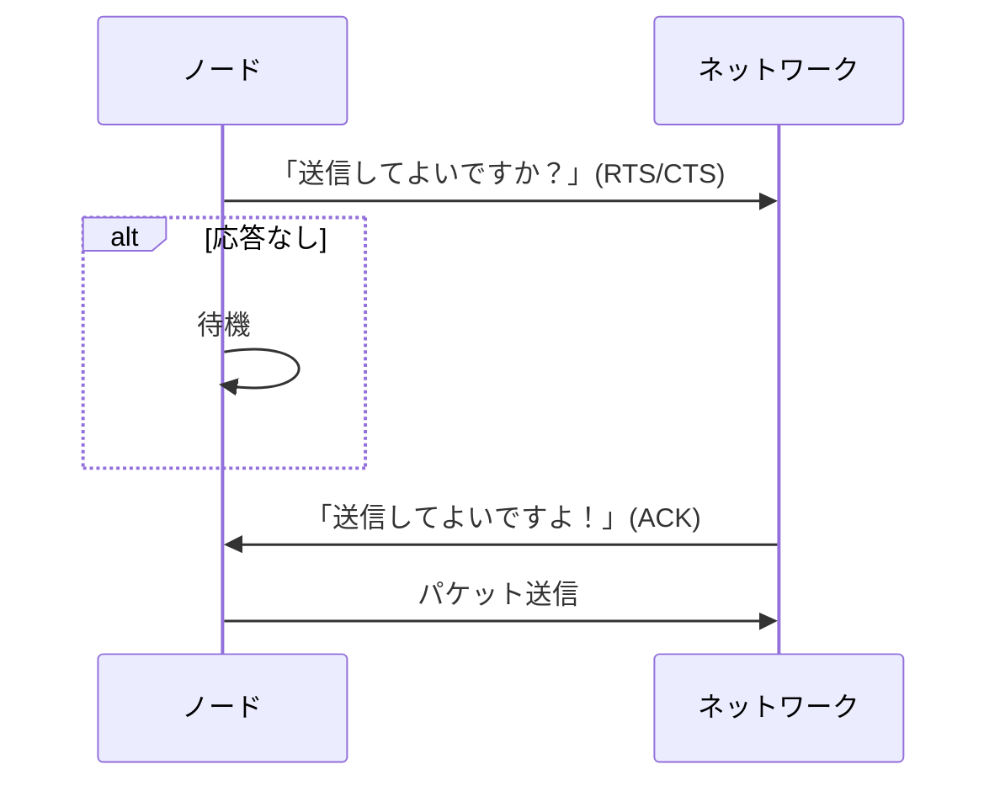

# LAN制御方式・VLAN・ネットワーク装置・ドメイン分割を体系的に整理

## はじめに

2025年10月のプロジェクトマネージャ試験受験を終え、2026年秋の情報処理安全確保支援士に向けて勉強中です。
本記事を含めた各知識のインデックスや学習の道のりについては、「[情報処理安全確保支援士への道のり(随時更新中)](https://qiita.com/teppei19980914/items/6411cb70f2937cbefdcc)」をご参照ください。
**本記事は学習した内容を記載しています。**

## 該当問題

[情報セキュリティスペシャリスト平成21年秋期 午前Ⅱ 問13](https://www.sc-siken.com/kakomon/21_aki/am2_13.html)
[情報セキュリティスペシャリスト平成24年秋期 午前Ⅱ 問17](https://www.sc-siken.com/kakomon/24_aki/am2_17.html)
[情報セキュリティスペシャリスト平成25年秋期 午前Ⅱ 問17](https://www.sc-siken.com/kakomon/25_aki/am2_17.html)
[情報処理安全確保支援士平成31年春期 午前Ⅱ 問12](https://www.sc-siken.com/kakomon/31_haru/am2_12.html)
[情報処理安全確保支援士平成31年春期 午前Ⅱ 問18](https://www.sc-siken.com/kakomon/31_haru/am2_18.html)
[情報処理安全確保支援士令和7年春期 午前Ⅱ 問18](https://www.sc-siken.com/kakomon/07_haru/am2_18.html)

## Ethernet

IEEE 802.3によって標準化された有線LAN規格で、OSI参照モデルの物理層とデータリンク層に対応しています。

### OSI参照モデル

異なるシステム間の通信を標準化するためにISOが策定した7階層モデルです。各階層については下記のとおりです。

|階層番号|名前|主な役割|
|:----|:----|:----|
|7|アプリケーション|利用者アプリに最も近い層|
|6|プレゼンテーション|データ形式変換(暗号/圧縮)|
|5|セッション|通信の開始／維持／終了|
|4|トランスポート|信頼性(TCP)・分割再構成|
|3|ネットワーク|経路選択/IPアドレス|
|2|データリンク|フレーム化/MACアドレス|
|1|物理|電気信号/光信号/ケーブル|

## LANの制御方式

複数端末が同じネットワーク媒体を共有するLAN上では、複数端末が同時に送信することで衝突(コリジョン)が発生してしまいます。そのため、「誰が、いつ、どのように送信するのか」を決める仕組みが必要であり、この仕組みがLANの制御方式(MAC方式(Media Access Control))です。

### 主要なMAC制御方式

* CSMA/CD
* トークンパッシング
* CSMA/CA

### CSMA/CD(Carrier Sense Multiple Access with Collision Detection)

送信前に回線が空いているか(キャリアセンス)を確認し、データを送信します。もし仮に、コリジョンが発生した場合は、再送する方式です。

#### コリジョンの検出

送信中の端末は、自身の送信信号と回線上に流れている信号を比較し、他端末との信号が混じって波形が崩れた場合、衝突の発生と判断します。
**上記検出方法は有線(Ethernet)だからこそ可能ですが、無線LANの場合は不可能なので、CSMA/CAが存在します。**

### トークンパッシング(Token Bus/Token Ring)

「トークン」と呼ばれるネットワーク上の特殊フレームが順番にノードを巡回し、トークンを持ったノードだけが送信できる方式です。トークンを保持しているノードはその瞬間は世界に一つだけなので、同時送信が起こらず衝突が発生しません。

#### メリット

* 衝突ゼロです
* 優先度制御が可能です(トークンの回り方を制御)
* リアルタイム性が要求される産業ネットワークに適します

#### デメリット

* トークンが失われると送信不能になります
* 物理構成・復旧が複雑です
* スイッチEther化で事実上廃れました

### CSMA/CA(Carrier Sense Multiple Access with Collision Avoidance)

有線LANのように衝突を検出できない無線環境で、事前に衝突を避ける(Avoidance)方式が必要です。

#### 衝突を避ける仕組み

無線上で送受信間による送信可否応答を行っています。

1. RTS/CTS(送信要求／クリア通知)
2. 送信前にランダム待機(バックオフ)
3. ACK を受け取るまで次を送りません

### 隠れ端末問題

CSMA/CAでは、各端末が互いに送信フレームを受信できることが前提になっています。しかし、2つの端末間の遮蔽物や位置関係によっては送信フレームを受信できないことがあります。この時、互いに他方の端末の送信を検知できないことになるため、同時送信による衝突が起こりやすくなります。これを隠れ端末問題と呼びます。

## ネットワーク装置の体系的整理(OSI参照モデルに基づく)

ネットワーク機器は **OSI参照モデルの階層** に従って機能が定義されています。

|レイヤ|主な役割|該当装置|
|---|---|---|
|L1 物理層|電気信号の伝送|リピータ、ハブ|
|L2 データリンク層|MACアドレス転送、衝突ドメイン制御|ブリッジ、スイッチ|
|L3 ネットワーク層|IPアドレス転送、経路選択|ルータ|
|L4～L7|アプリケーション特化制御|ゲートウェイ、FW、プロキシ等|

### リピータ(Repeater)

**OSI L1(物理層)** のネットワーク装置です。

#### 機能

- 電気信号の増幅/再生成(re-generation)を行います
- ケーブル距離の延長に使用します
- フレーム内容の理解はしません(単なる電気信号の転送)

#### 特徴

- 衝突ドメインはそのまま拡大されます
- セグメントを分割できず、負荷改善にはなりません
- 旧式バス型イーサネットでは利用されましたが、現在はほぼ使用されません

### ブリッジ(Bridge)

**OSI L2(データリンク層)** の装置です。

#### 機能

- MACアドレス学習(Learning)を行います
- フレーム転送/フィルタリング(Forwarding/Filtering)を行います
- 衝突ドメインを分割し、効率化します

#### 特徴

- スイッチングハブの元祖技術です
- スパニングツリープロトコル(STP)によるループ防止(IEEE 802.1D)に対応しています
- ブロードキャストドメインは分割できません

### ルータ(Router)

**OSI L3(ネットワーク層)** の装置です。

#### 機能

- IPアドレスを基にパケット転送を行います
- 経路選択(Routing)を行います
- ブロードキャストドメインの分割を行います
- NAT/PATなどのアドレス変換(RFC 3022)に対応しています

#### ルーティングの代表的プロトコル

|種類|例|RFC|
|---|---|---|
|IGP(内部)|RIP/OSPF/IS-IS|RIP:1058、OSPF:2328|
|EGP(外部)|BGP|RFC 4271|

### ゲートウェイ(Gateway)

**OSI L4～L7 の異なるプロトコル／アプリケーションを接続する** 装置の総称です。

#### 機能

- プロトコル変換(例：IPv4 ⇔ IPv6、SMTP ⇔ X.400)を行います
- アプリケーションレベルの仲介を行います
- システム間連携(メッセージ変換等)を行います

#### ゲートウェイの例

- VoIPゲートウェイ(SIP ⇔ PSTN)
- メールゲートウェイ(SPAM対策、ウイルス対策)
- APIゲートウェイ(認証/レート制限)

一般的な「ルータ＝インターネットのゲートウェイ」という使い方は俗称であり、厳密には異なります。

### ネットワーク装置の比較(試験で頻出)

|装置|OSI|できること|できないこと|
|---|---|---|---|
|リピータ|L1|信号増幅|MAC識別/ループ制御|
|ブリッジ|L2|MAC転送/衝突ドメイン分割|IPルーティング|
|ルータ|L3|IP転送/経路選択/BD分割|アプリ変換|
|ゲートウェイ|L4～L7|プロトコル/アプリ変換|低レイヤ転送|

## コリジョンドメインとブロードキャストドメイン

### ブロードキャストフレーム(Broadcast Frame)

ネットワーク内に属するすべてのノードに対してデータを通信するためのフレームです。ブロードキャストフレームが届く範囲は「ブロードキャストドメイン」と呼ばれ、リピータやハブ、データリンク層のブリッジで構成されたネットワークです。

### コリジョン(Collision)

同一伝送路上で別々の端末から発信された信号同士が衝突する現象です。コリジョンの伝搬が発生する範囲は「コリジョンドメイン」と呼ばれ、物理層で動作するリピータやハブを介して接続されたネットワークです。

### コリジョンドメインとブロードキャストドメインの範囲

[イメージ]

**出典：[情報処理安全確保支援士令和7年春期 午前Ⅱ 問18](https://www.sc-siken.com/kakomon/07_haru/am2_18.html)**

| |コリジョン|ブロードキャストフレーム|
|:----|:----|:----|
|ルータ|伝搬しません|中継しません|
|ブリッジ|伝搬しません|中継します|
|リピータ|伝搬します|中継します|

### サブネットとドメイン分割

|用語|意味|
|---|---|
|衝突ドメイン|同時送信で衝突が起きる範囲です(ブリッジで分割可)|
|ブロードキャストドメイン|ブロードキャストが届く範囲です(ルータで分割可)|

## VLAN(Virtual LAN)技術と各種VLANモデル

### VLANとは

VLANとは、**物理ネットワークを仮想的に分割し、独立した複数のネットワークとして扱う技術** です。IEEE 802.1Qにより標準化され、スイッチ全体を柔軟に論理分割します。

### VLANの目的

- **セキュリティ向上**(ブロードキャストドメイン分離)
- **ネットワーク負荷軽減**
- **運用柔軟性の向上(異動時に配線変更不要)**
- **ネットワーク管理の容易化**

### VLANの分類

1. ポートベースVLAN(Port-based VLAN)
2. アドレスベースVLAN(MAC-based/IP-based VLAN)
3. ポリシーベースVLAN(Policy-based VLAN)
4. タグVLAN(IEEE 802.1Q Tag VLAN)

### ポートベースVLAN(Port-based VLAN)

最も一般的なVLANで、**スイッチの物理ポート単位でVLANを割り当てる方式** です。

例：

- ポート 1--4 → VLAN10
- ポート 5--8 → VLAN20

#### 利点

- 設定が容易です
- ほぼ全機種で利用可能です

#### 欠点

- 端末を他ポートへ移動すると設定変更が必要です

### アドレスベースVLAN

端末のアドレス情報に基づいてVLANを割り当てる方式です。

#### MACアドレスベースVLAN

- PCの **MACアドレス** を基準にVLANを割り当てます
- 端末がどのポートに移動してもVLANが保持されます

#### IPアドレスベースVLAN

- 端末の **IPアドレス範囲** でVLANを割り当てます
- L3スイッチで多く利用される方式です

#### 利点

- 端末移動に対して強いです
- 部署や利用IP範囲による柔軟な分類が可能です

#### 欠点

- スイッチによる追加処理が増え負荷が高くなります

### ポリシーベースVLAN(Policy-based VLAN)

ネットワーク管理者が定義する **ポリシー(ルール)** に基づいてVLANを動的割り当てする方式です。

使用される属性例は以下のとおりです。

- MACアドレス
- IPアドレス
- プロトコル(IPv4/IPv6/IPXなど)
- ユーザ認証情報(IEEE 802.1X)
- アプリケーション情報

#### 利点

- **高い柔軟性** があります
- BYODや大規模企業ネットワークで有効です

#### 欠点

- 構成が複雑です
- スイッチに高い処理能力が必要です

### タグVLAN(IEEE 802.1Q VLAN)

スイッチ間でVLANを運ぶために標準化された方式です。Ethernetフレームへ **4バイトのVLANタグ** を挿入しVLANを識別します。

#### タグ構造(802.1Q Tag：4バイト)

| フィールド | ビット数 | 内容 |
|-----------|---------|------|
| **TPID** | 16bit | タグ識別子(常に 0x8100) |
| **PCP** | 3bit | 優先度(QoS) |
| **DEI** | 1bit | 破棄可否指標 |
| **VLAN ID** | 12bit | VLAN番号(1～4094) |

### アクセスポートとトランクポート

#### アクセスポート(Access Port)

- 1つのVLANのみ所属します
- 端末(PC)接続用です
- フレームは **タグなし(untagged)** です

#### トランクポート(Trunk Port)

- 複数VLANを運びます
- スイッチ間接続に利用します
- フレームは **タグ付き(tagged)** です

### VLAN間ルーティング(Inter-VLAN Routing)

異なるVLAN同士は通信できないため **L3スイッチまたはルータが必要** です。

方式は以下のとおりです。

- Router-on-a-stick
- L3スイッチの SVI(Switch Virtual Interface)

### VLAN登録プロトコル

- **GVRP/MVRP** → VLAN情報を自動伝播します

### VLAN Hopping 攻撃

攻撃者がVLANを跨いで不正通信を行う攻撃です。

主な手法は以下のとおりです。

- Switch Spoofing
- Double Tagging Attack

対策は以下のとおりです。

- 不要なトランクポートを閉じます
- ネイティブVLANを変更します
- 802.1X認証の利用

### 認証VLAN

ネットワーク接続前に「MACアドレス認証」「ID+パスワードによる認証」「IEEE 802.1X」などでユーザを特定し、ユーザごとに所属すべきVLANに振り分けることで端末のグルーピングを行います。これにより、接続ポート単位やアドレス単位というグルーピングができない無線アクセスポイントへの接続でもVLANに対応させることができます。

### VXLAN

イーサネットフレーム全体をIP/UDPヘッダーとVXLANヘッダーでカプセル化することで、レイヤー3ネットワーク上に論理的なレイヤー2ネットワークを構築するトンネリングプロトコルです。離れたサブネットに属する複数のレイヤー2ネットワークをつなぐ、共通のレイヤー2ネットワークを構築するために使用されます。VXLANセグメント同士はカプセル化を行うVTEP(Virtual Tunnel End Point)を経由して通信を行います。

## 周辺知識

### スイッチングハブ(Layer2 Switch)

スイッチングハブの登場によって、CSMA/CDの役割を終えました。

* MACアドレス学習を行います
* 衝突ドメインの分離を行います
* 全二重通信(コリジョンなし)に対応しています
* VLAN(IEEE 802.1Q)対応です

### L3スイッチ

- ルータ機能 + スイッチ機能を持ちます
- 企業LANの主流装置です

### ハブ(Repeater Hub)

- リピータの多ポート版です
- L1装置で全ポートに信号を送ります(衝突多発)

### Spanning Tree Protocol(STP)

* ループ防止を行います
* BPDUによるルートブリッジ選定を行います

### ルーティングの基礎

#### スタティック vs ダイナミック

- スタティックルート：手動設定です
- ダイナミックルート：プロトコルで自動学習します

#### OSPFの特徴(RFC 2328)

- リンクステート方式です
- 収束が高速です
- 階層構造(エリア)を構成可能です

#### BGPの特徴(RFC 4271)

- AS(自律システム)間ルーティングです
- 最も重要なインターネットルーティングプロトコルです

### NAT(Network Address Translation)

プライベートIPとグローバルIPを相互に変換します。NATは1つのプライベートIPと1つのグローバルIPが対象ですが、NAPTによって多数のプライベートIPから1つのグローバルIPに変換できます。NAPTを使った場合、LAN内の端末はポート番号で識別します。

### DHCP(Dynamic Host Configuration Protocol)

ホストにIP設定を自動配布するプロトコルです。これがあることで、IP設定を明示的に設定していない場合でも、動的にIP設定が配布されます。

### QoS(Quality of Service)

* 優先度制御(Voice/Video)を行います
* Token Passing時代の優位性をEthernetが取り込んだものです

### 無線LANの周辺知識

* WPA2/WPA3
* AES-CCMP
* マネージメントフレーム保護(802.11w)
* DFS(レーダー干渉回避)
