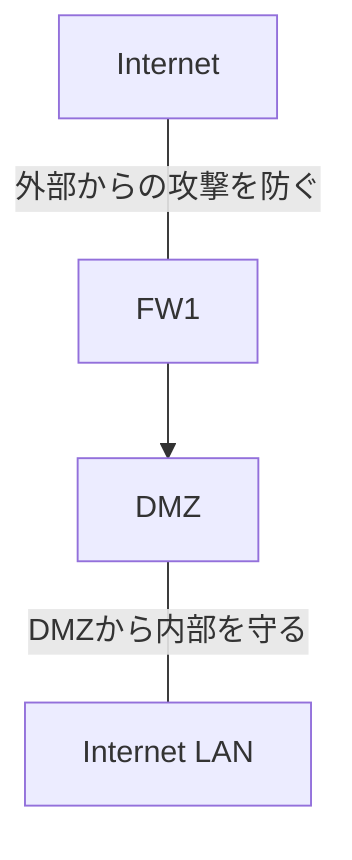

# ネットワークセキュリティ機器と境界防御 ― IDS/IPS・WAF・ファイアウォール・サンドボックス・ハニーポット・DMZの体系整理

## はじめに

2025年10月のプロジェクトマネージャ試験受験を終え、2026年春の情報処理安全確保支援士に向けて勉強中です。
本記事を含めた各知識のインデックスや学習の道のりについては、「[情報処理安全確保支援士への道のり(随時更新中)](https://qiita.com/teppei19980914/items/6411cb70f2937cbefdcc)」をご参照ください。
**本記事は学習した内容を記載しています。**

## 該当問題

[平成21年秋期試験問題 午前Ⅱ 問5](https://www.sc-siken.com/kakomon/21_aki/am2_5.html)
[情報セキュリティスペシャリスト平成22年秋期 午前Ⅱ 問16](https://www.sc-siken.com/kakomon/22_aki/am2_16.html)
[情報セキュリティスペシャリスト平成24年春期 午前Ⅱ 問7](https://www.sc-siken.com/kakomon/24_haru/am2_7.html)
[情報セキュリティスペシャリスト平成26年春期 午前Ⅱ 問6](https://www.sc-siken.com/kakomon/26_haru/am2_6.html)
[情報セキュリティスペシャリスト平成26年秋期 午前Ⅱ 問17](https://www.sc-siken.com/kakomon/26_aki/am2_17.html)
[情報処理安全確保支援士平成29年秋期 午前Ⅱ 問9](https://www.sc-siken.com/kakomon/29_aki/am2_9.html)
[情報処理安全確保支援士令和2年秋期 午前Ⅱ 問14](https://www.sc-siken.com/kakomon/02_aki/am2_14.html)
[情報処理安全確保支援士令和5年春期 午前Ⅱ 問12](https://www.sc-siken.com/kakomon/05_haru/am2_12.html)
[情報処理安全確保支援士令和5年秋期 午前Ⅱ 問12](https://www.sc-siken.com/kakomon/05_aki/am2_12.html)
[情報処理安全確保支援士令和6年秋期 午前Ⅱ 問12](https://www.sc-siken.com/kakomon/06_aki/am2_12.html)

## IDS(Intrusion Detection System)

ネットワークやホストに対する不正行為を検知する仕組みです。

### IDSの種類

- **NIDS(Network IDS)**: ネットワーク全体を監視します
- **HIDS(Host IDS)**: ホスト内部のログ/ファイル改ざんを監視します

## IPS(Intrusion Prevention System)

ネットワークやホストに対する不正行為を検知し、リアルタイムで防御する仕組みです。

### IDSとIPSとの違い

| 項目 | IDS | IPS |
|:-----|:-----|:-----|
| 主目的 | 検知 | 検知 + 防御 |
| 動作 | パッシブ | インライン(通信経路上) |
| 誤検知時 | アラートのみ | 通信遮断のリスク |

### シグネチャ型IPS(Signature-based IPS)

既知の攻撃パターン(シグネチャ)と一致するネットワークトラフィックを検知/遮断する方式です。

#### 長所

1. 既知攻撃に対して高精度です(誤検知が少ない)
2. 明確な攻撃パターンを確実にブロックできます
3. 運用しやすいです(シグネチャ更新で対策可能)

#### 短所

1. 未知攻撃(ゼロデイ)には弱いです
2. シグネチャ更新が遅いと防げません
3. 高度に難読化・変形された攻撃を見逃す可能性があります

### アノマリ型IPS

正常な通信パターンを基準として学習し、その基準から逸脱(アノマリ: 異常)した通信を不正として検知/遮断する方式です。

#### 長所

1. 未知攻撃(ゼロデイ)に強いです
2. 攻撃の変形/難読化にも強いです
3. 内部不正や標的型攻撃に強いです

#### 短所

1. 誤検知(False Positive)が多いです
2. 運用負荷が高いです
3. 学習期間が必要です

### シグネチャ型IPSとアノマリ型IPSの比較

| 種類 | 概要 | 長所 | 短所 |
|:-----|:-----|:-----|:-----|
| シグネチャ型 | 既知攻撃パターン照合 | 精度高い | ゼロデイに弱い |
| アノマリ(異常検知)型 | 正常パターンからの逸脱を検知 | 未知攻撃に強い | 誤検知が多い |
| ハイブリッド型 | 両方組み合わせ | バランス良 | 実装が複雑 |

### IPSが遮断する攻撃例

* SQLインジェクション
* XSS
* 既知マルウェアのC2通信
* スキャン(Nmap, Masscan)
* シェルコード(RCE攻撃)
* サーバ攻撃(Apache/PHP脆弱性)
* コマンドインジェクション
* 暗号化通信内でのスキャン
* DoSのシグネチャ攻撃

## WAF(Web Application Firewall)

**WAF(Web Application Firewall)** は、Web アプリケーションを標的とする攻撃(SQL インジェクション、XSS、ディレクトリトラバーサルなど)を検知/防御するための防御装置です。

### エビデンス

- **NIST SP 800-95**: WAF はアプリケーション層(Layer 7)脅威に対する防御として推奨されています
- **OWASP**: WAF は「脆弱性が残る環境における防御レイヤの 1 つ」と位置づけられています
- **PCI DSS 6.6**: WAF またはコードレビューの実施を義務化しています

### WAF の目的

- Web アプリへの不正リクエストを検知/遮断します
- 攻撃をアプリケーションに届く前にブロックします
- アプリケーションの脆弱性(未修正)を暫定的に保護します

### WAFが防御対象とする代表的攻撃

* SQLインジェクション
* XSS(クロスサイトスクリプティング)
* コマンドインジェクション
* パストラバーサル
* 不正なファイルアップロード

**ネットワーク層ではなく、アプリケーション層を守る点が特徴です。**

### ブラックリスト方式(Blacklisting)

**既知の攻撃パターン** を登録し、それに該当するリクエストを遮断する方式です。

#### 特徴

- OWASP ModSecurity Core Rule Set(CRS)のような**シグネチャベース**です
- SQL Injection, XSS, Command Injection などのパターンにマッチした通信を遮断します
- 既知攻撃に有効です
- 未知の攻撃には弱いです(ゼロデイ攻撃には不十分)

#### 利点

- 導入が容易です
- 誤検知が比較的少ないです

#### 欠点

- 未知攻撃/変形攻撃に弱いです
- シグネチャ更新が必要です

### ホワイトリスト方式(Whitelisting)

**許可された正規リクエストのみを通過させる方式です。**

#### 特徴

- 例: 正規の URL、パラメータ形式、データ型などを定義します
- それ以外のリクエストはすべてブロックします
- 未知攻撃に強いです

#### 利点

- ゼロデイ攻撃(未知攻撃)に強いです
- アプリケーション仕様が明確であれば非常に強固です

#### 欠点

- 作成/メンテナンスが大変です
- 動的サイトではルール管理が重いです
- 誤検知が発生しやすいです

### ハイブリッド方式(Blacklist + Whitelist)

多くの商用 WAF では、下記を組み合わせて防御力を高めています。

- ブラックリスト方式(攻撃パターン検知)
- ホワイトリスト方式(正常動作モデル)

### フォールスポジティブ(False Positive)

#### 定義

正常な通信を、誤って「攻撃」と判断して遮断してしまうことです。

#### 発生する理由

* 厳しすぎるシグネチャ
* 業務入力に SQL 文字列等が含まれる
* 正常だが仕様上例外的な通信

#### 影響

* 正規ユーザのアクセス遮断
* 業務停止・UX低下
* 問い合わせ・運用負荷増大

### フォールスネガティブ(False Negative)

#### 定義

本来は攻撃である通信を、誤って「正常」と判定して通過させてしまうことです。

#### 発生する理由

* 未知の攻撃(ゼロデイ攻撃)
* シグネチャ未更新
* 攻撃手法の難読化(エンコード/分割)
* 業務特化アプリの特殊な入力仕様

#### 影響

* 攻撃を防げません
* 情報漏えい・改ざんが発生します
* WAF があっても侵害されます

### フォールスネガティブとフォールスポジティブの関係

| 観点 | フォールスネガティブ | フォールスポジティブ |
|:-----|:-----|:-----|
| 内容 | 攻撃を見逃す | 正常を攻撃扱い |
| 主な影響 | 情報漏えい | 業務停止 |
| 原因 | 検知不足 | 過剰検知 |
| セキュリティ | 低下 | 向上(しすぎ) |
| 可用性 | 維持 | 低下 |

### WAF が防御可能な攻撃(Web アプリ脅威)

CSRF は WAF だけでは完全防御できず、トークン等の対策が必要です。

| 攻撃手法 | 説明 |
|---------|------|
| SQL Injection | パラメータに悪意ある SQL を注入 |
| XSS | HTML/JS を注入しブラウザで実行 |
| Directory Traversal | `../` によるファイルアクセス |
| Command Injection | OS コマンドを実行させる |
| CSRF | 利用者を欺いて不正操作を行わせる |
| HTTP Request Smuggling | 不正に混在したリクエストを送る |
| Path Manipulation | 不正パスを用いたアクセス |

### WAF の検査方式

| 方式 | 説明 |
|------|-----|
| **シグネチャ方式** | 既知攻撃のパターンマッチ(ブラックリスト) |
| **アノマリ方式** | 正常パターンからの逸脱検知(ホワイトリスト寄り) |
| **プロトコル検査** | HTTP RFC 違反リクエストを拒否 |
| **行動モデル** | 過去の挙動との比較 |

### ネットワーク型 WAF

専用アプライアンスやクラウド型サービス(AWS WAF など)です。

- 大規模環境向けです
- 運用が容易です
- 可視化/ログ収集が強力です

### ホスト型 WAF

アプリケーションサーバへ直接導入(ModSecurity など)します。

- 細かな制御が可能です
- コストが低いです
- サーバ負荷と運用が必要です

### WAF の限界

WAF だけでは防げない攻撃も多いです。

#### 防げない例

WAF は「万能」ではなく、アプリケーション側の安全設計が必要です。

- **ロジックフロー攻撃(業務仕様の悪用)**
- **CSRF(アプリ側の対策必須)**
- **認証/認可の欠陥**
- **パスワード総当たり**

## ファイアウォールの体系整理

### ステートフルインスペクション方式(Stateful Inspection)

ステートフルFWは **通信状態(セッション情報)を保持してパケットを判断するファイアウォール方式**です。

#### Statelessとの違い

- Stateless: パケット単体を見て許可/拒否します
- Stateful: セッションの前後関係を理解し、応答パケットを自動許可します

### ステートテーブル(State Table)の役割

記録される主な内容:

- 送信元/宛先 IP/ポート
- プロトコル(TCP/UDP)
- TCPフラグ
- NAT前後のIP/Port
- セッション状態(ESTABLISHED など)
- タイムアウト
- セッション開始時刻

State Table に一致するパケットは **応答パケットとして自動許可** されます。

### TCP の状態管理

Stateful FW は以下を追跡して不正パケットを排除します。

- SYN
- SYN/ACK
- ACK
- ESTABLISHED
- FIN/FIN-ACK

防御例:

- 不正な ACK の排除
- SYN Flood の半開状態管理
- Xmas/FIN スキャンの検知

### UDP の疑似セッション管理

UDP は接続がないため、「送信直後の戻り通信を一定時間だけ有効化する」方式を採用します。

記録内容:

- 送信元/宛先 IP/ポート
- タイムアウト

DNS 等の短い通信に適します。

### Stateful FW が防げる攻撃

| 攻撃種別 | 防御理由 |
|----------|----------|
| 不正な新規接続 | State Table にないため遮断 |
| SYN Flood | 半開状態監視 |
| IP スプーフィング | 応答方向の整合性監視 |
| Port Scan | 不正な TCP フラグを検知 |
| 断片化攻撃 | 再組立(Reassembly)で検査 |

### パケットフィルタ(Stateless)との比較

| 項目 | Stateless | Stateful |
|------|-----------|----------|
| 判断材料 | IP/Port/Flag | IP/Port + セッション状態 |
| 応答パケット | 明示的許可が必要 | 状態一致で自動許可 |
| TCP状態理解 | なし | あり |
| 強度 | 中 | 高 |

### NAT と Stateful FW の連携

State Table に NAT変換前後の情報を保持することで以下を実現します。

- 内部 → 外部の応答を正しく戻します
- 不正な外部通信は遮断します

### ファイアウォールの分類

- パケットフィルタ型(Stateless)
- ステートフルインスペクション型(Stateful)
- アプリケーションゲートウェイ
- NGFW(アプリ識別/SSL復号/IPS機能)
- UTM(FW+IPS+AV+SPAM)

### ダイナミックパケットフィルタリング(Dynamic Packet Filtering)

#### ダイナミックパケットフィルタリングとは

ステートフルインスペクションの発展形であり、**アプリケーションプロトコルの制御チャネルの内容を解析し、必要なデータチャネルのポートを動的に開く技術** です。

##### 機能の本質

通常のパケットフィルタでは「どのポートを開けるべきか」がアプリケーションによって動的に変化するため静的ルールでは対応が困難です。

ダイナミックPFは下記の動作を行います。

- **制御チャネルの内容を理解します(= アプリ層情報を参照)**
- **必要なセッション用ポートを FW が自動開放し、終了後閉じます**

#### FTP の例(典型的な出題ポイント)

##### アクティブモード FTP

**外部から内部への新規接続が必要なため通常のFWでは通りません**

- クライアント → サーバへ: TCP 21(制御)
- データ転送はサーバ → クライアントの **TCP 20**

##### ダイナミックパケットフィルタリングの動作

FW は制御チャネル(PORT コマンド)を解析します。

1. クライアントが通知した待受ポート番号を読みます
2. そのポートへのサーバからの接続だけを **一時許可**します
3. データ転送終了後に自動で閉じます

##### メリット

- 必要なポートだけを自動開放します
- 転送中のセッションに限定して許可します
- セキュリティと利便性の両立を実現します

#### Passive モード FTP の扱い

Passive モード:

- クライアント → サーバの制御チャネルで PASV コマンドを送ります
- サーバが **使用するデータポート番号** を応答で通知します

ダイナミックPF はこの応答を解析し、**必要な宛先ポートだけを自動開放します**。

#### VoIP(SIP/H.323)での利用

SIP や H.323 は多くの RTP メディアポートを動的に割り当てます。

ダイナミックPFは下記を解析し、必要なポートのみ FW が一時的に開きます。

- SIP INVITE メッセージの SDP 部分
- H.323 のコールセットアップ情報

#### Stateful Inspection との違い

| 項目 | Stateful Inspection | Dynamic Packet Filtering |
|------|----------------------|---------------------------|
| 主な解析対象 | ネットワーク層/トランスポート層 | アプリケーション層(制御チャネル) |
| 目的 | セッション状態の追跡 | アプリ動作に必要なポートを動的開放 |
| FTP制御 | セッション管理のみ | PORT/PASV の内容まで理解してポート開放 |

## IPスプーフィング攻撃

### 定義(エビデンス)

- RFC 791(IP)
- RFC 793(TCP)
- IPA「10大脅威」解説資料

**IPスプーフィング(IP Spoofing)とは、パケットの送信元IPアドレスを偽装し、正規の通信相手になりすまして通信を行う攻撃です。**

### なぜIPスプーフィングが可能なのか

IPプロトコルの設計上の特徴が原因です。

- IPヘッダの送信元アドレスは **自己申告制**です
- ネットワーク層(L3)では送信元の真正性を検証しません
- 認証機構が存在しません

→ **IPアドレス自体は「身分証明」になりません**

### IPスプーフィングの技術的仕組み

#### 偽装パケットの作成

攻撃者は次のようなパケットを送信します。

```
送信元IP: 信頼されている内部ホスト
宛先IP: 攻撃対象サーバ
```

- 実際の送信元は攻撃者です
- IPヘッダだけを書き換えて送信します

#### TCP通信での困難点(重要)

TCPは **3-wayハンドシェイク** を行います。

1. SYN(攻撃者 → サーバ)
2. SYN/ACK(サーバ → 偽装されたIP)
3. ACK(偽装IP → サーバ)

→ 攻撃者は **SYN/ACKを受け取れません**
→ 通常の双方向通信は困難です

### IPスプーフィングが使われる代表的攻撃

#### SYN Flood攻撃(DoS)

- 送信元IPを大量に偽装します
- サーバは存在しない相手に SYN/ACK を返し続けます
- セッション資源枯渇します

→ **IPスプーフィング x DoS の典型例**です

#### 反射/増幅型DDoS(DRDoS)

- DNS/NTP/SNMP など
- 小さな要求に対し大きな応答が返るプロトコルを利用します

##### 攻撃の流れ

1. 送信元IPを「被害者」に偽装します
2. 公開サーバへリクエスト送信します
3. 応答が被害者へ集中します

→ **IPスプーフィングが不可欠**です

#### TCPシーケンス番号予測攻撃(古典的)

- 信頼関係(rlogin 等)を悪用します
- シーケンス番号を予測します
- なりすましログインします

### IPスプーフィング単体では成立しない理由

| 理由 | 説明 |
|---|---|
| 応答が届かない | 偽装IPに返る |
| 状態管理が困難 | TCPの整合性が取れない |
| ログに痕跡が残る | 完全秘匿は不可 |

→ **他の攻撃と組み合わせて威力を発揮します**

### IPスプーフィングへの対策(試験頻出)

#### パケットフィルタリング

- 内部ネットワークから外部IPを送信元とするパケットを遮断します
- 外部から内部IPを送信元とするパケットを遮断します

→ **送信元アドレスの妥当性検証**です

#### ingress/egress フィルタリング(RFC 2827/BCP38)

- ISPレベルで実施します
- 自ネットワーク以外のIPを遮断します

→ **IPスプーフィング対策の基本原則**です

#### ステートフルインスペクションFW

- TCPの状態遷移を監視します
- 不正なSYN/ACKを拒否します

#### 暗号化/認証の導入

- IPsec(AH/ESP)
- TLS
- VPN

→ **IPアドレスではなく「鍵」で認証します**

### ARPスプーフィングとの違い

| 項目 | IPスプーフィング | ARPスプーフィング |
|---|---|---|
| レイヤ | L3 | L2 |
| 偽装対象 | IPアドレス | MACアドレス |
| 主目的 | DoS/反射攻撃 | MITM |
| 対策 | FW/BCP38 | ARP監視 |

### IPスプーフィングとログ分析

- ログの送信元IPは信用できません
- 相関分析/挙動分析が必要です
- フォレンジックで重要です

### 非同期通信/攻撃対策

- SYN Flood: Half-open 管理
- Fragmentation: 再組立で異常検知
- IP Spoofing: RFC 2827 ベースのソース検証
- 非同期通信: State Table と不整合なら拒否

## サンドボックス(Sandbox)

サンドボックスとは、**プログラムを隔離された環境で実行し、システム本体への影響を防ぐための技術**です。

### 用途

- マルウェア解析
- メール添付ファイルの安全性確認
- Webブラウザの隔離動作
- ゼロデイ攻撃の検知

### サンドボックスの方式

NIST SP 800-94 に基づき下記のように分類されます。

#### OSレベルの隔離

- Linux Namespaces/cgroups
- Windows Sandbox/WDAG
- 仮想メモリ領域の分離

#### 仮想化ベース

- VMware/VirtualBox/QEMU
- Hypervisor によりゲストOSを完全隔離します

#### アプリケーションサンドボックス

- Chrome/Edge のプロセス隔離
- Android アプリのサンドボックス

### サンドボックスのメリット

- 未知マルウェアも安全に解析可能です
- OSや実システムの改ざんを防ぎます
- EDR やメールセキュリティでの標準技術です

### サンドボックスの弱点

- Anti-Sandbox 技術で検知/回避される可能性があります
- 実機動作と完全一致しません
- リソース消費が大きいことがあります

## ハニーポット(Honeypot)

ハニーポットとは **攻撃者を誘導し、攻撃手法を観察/記録するための疑似システム**です(NIST SP 800-94)。

### 主な目的

- 攻撃ツール/マルウェアの収集
- 攻撃者の挙動分析
- 侵入の初動(IOCs)を取得
- 組織全体の防御力向上

### ハニーポットの分類

#### Low-interaction Honeypot

- 最小限のサービスを偽装します
- リスクが低いです
- 例: Honeyd

#### High-interaction Honeypot

- 実システムを用います
- 深い分析が可能ですがリスクが高いです
- 例: Cowrie/Kippo

### 設置時の注意点

- 攻撃踏み台として悪用される危険があります
- 本番ネットワークとは完全隔離する必要があります
- 継続的な監視が必須です

### サンドボックスとハニーポットの比較

| 観点 | サンドボックス | ハニーポット |
|---|---|---|
| 目的 | マルウェアなどの安全な実行環境 | 攻撃者を誘導し観測 |
| 対象 | ファイル/プログラム | 攻撃者 |
| 技術カテゴリ | 隔離(Isolation)技術 | 欺罔(Deception)技術 |
| リスク | 比較的低い | 誤用されるリスクあり |
| 主用途 | マルウェア解析、事前検知 | 攻撃情報収集、早期警戒 |

## DMZ(非武装地帯: Demilitarized Zone)

外部ネットワーク(インターネット)からアクセスされる必要があるサーバ群を配置する「隔離されたネットワーク領域」です。
つまり、外部に公開しなくてはいけないサーバ(DNS/Web/メール)を社内LANとは分離して配置する場所のことを指しています。

### なぜDMZが必要なのか

侵害されたときの被害拡大を防ぐためです。
もし公開サーバーを社内LANに配置し、公開サーバ内に攻撃者が侵入した場合、即座に社内ファイルサーバや端末が次々に感染してしまいます。
これを防ぐために、DMZが存在します。



### DNSサーバ

ドメイン名(例: example.com)をIPアドレスに紐づけて管理しています。
用途は下記2つです。

1. 権威DNSサーバ(Authoritative DNS)
2. キャッシュDNS(リゾルバ)

#### 権威DNSサーバ

該当ドメインの公式情報を持つDNSです。
インターネットから問い合わせが来るため、基本的にDMZに配置します。

#### キャッシュDNS

社内PCのDNS問い合わせを外部へ中継します。
社内PCからの問い合わせしかなく、外部(DMZ)に配置すると危険が増すため、社内LANに配置します。

### DNSキャッシュポイズニング

攻撃者が偽のDNS応答をキャッシュDNSに信じ込ませ、正規のドメインを攻撃者のIPに誘導する攻撃です。
例えば本来、

```TEXT
www.bank.com → 198.51.100.10（正規サイト）
```

であるべきが、DNSキャッシュポイズニングによって、

```TEXT
www.bank.com → 203.0.113.66（攻撃者の偽サイト）
```

と解決してしまいます。
ユーザは正規のサイトと信じているわけですから、偽サイト上でユーザIDやパスワードを入力し、攻撃者に窃取されてしまうわけです。

#### DNSキャッシュポイズニングが発生する仕組み

DNSには応答の正当性を検証する仕組みがありません。
DNS問い合わせは次の情報だけで識別されます。

* トランザクションID(16bit = 65536通り)
* 送信元ポート(以前は固定53番)
* クエリ内容(www.example.com)

上記から攻撃者は下記のようなリクエストを大量に送り付けます。

```TEXT
Your query for www.bank.com is here.
Transaction-ID: 12345
Answer: www.bank.com → 攻撃者のIP
```

上記リクエストのタイミングとIDが一致すれば、偽のIPアドレスがキャッシュされてしまいます。

#### DNSキャッシュポイズニングの影響

DNSはインターネットの住所録なので、改ざんされると全ユーザが攻撃されてしまう極めて深刻な攻撃です。

* フィッシング誘導(偽サイトへ)
* マルウェア配布サイトへ誘導
* VPNやメールサーバの偽装
* 社内の全通信を攻撃者の中継点へ転送(MITM攻撃)

#### DNSキャッシュポイズニング対策

下記5つがあります。

1. 送信元ポートランダム化
2. トランザクションIDのランダム化
3. DNSSEC
4. キャッシュDNSを外部公開しない
5. DMZ + 内部LANの正しい構成

##### 送信元ポートランダム化

以前はDNSクエリ送信元ポートが53番固定だったので、容易に推測できました。
現在は 1024〜65535 のランダムポートを使用することで難度が大幅に上昇しています。

##### トランザクションIDのランダム化

IDを予測できない乱数にします。

##### DNSSEC

DNS応答にデジタル署名を付与する仕組みです。
権威DNSが署名し、リゾルバが公開鍵で検証します。
これにより、攻撃者が偽レコードを送っても署名検証に失敗し、キャッシュされません。
**キャッシュポイズニングを本質的に解決する技術です。**

##### キャッシュDNSを外部公開しない

オープンリゾルバ(Open Resolver)は攻撃の対象となります。
そのため、外部公開しないことが極めて重要です。

##### DMZ + 内部LANの正しい構成

「権威DNSをDMZ」に配置し、「キャッシュDNS」は内部LANに配置する構成が最も安全です。

## WAF/IPS/FW の違い

| 技術 | 防御対象 | 主なレイヤ |
|------|-----------|---------------|
| FW | IP/ポートのアクセス制御 | L3/L4 |
| IPS | ネットワーク攻撃防御(シグネチャ中心) | L3〜L7 |
| WAF | Webアプリ攻撃対策(XSS, SQLi 等) | L7 |

## 周辺知識

### UTM(統合脅威管理)

FW/IPS/アンチウィルス/SPAM対策を統合したもので、中小企業向けです。

### SIEM(Security Information and Event Management)

FWやプロキシサーバ、CASBなどのログデータを収集・分析して、攻撃を検知する機能を高度化したセキュリティ機器です。
主要機能として、(1)統合ログ管理サーバと同等の機能・ログの検索、(2)異常検知、(3)アラート通知/レポート出力機能があります。
SOCで利用されるツールです。

### SOAR(Security Orchestration, Automation and Response)

サイバー攻撃を監視する専任組織であるSOCにおける、監視業務やインシデント対応手順の自動化、効率化を進める体制や技術、ソリューションのことを言います。

### EDR(Endpoint Detection and Response)

エンドポイント振る舞い監視 + サンドボックス連携によるマルウェア解析を行います。

### IPSと比較される技術(EDR/XDR/NDR)

| 種類 | 監視対象 |
|:-----|:-----|
| EDR | エンドポイント |
| NDR | ネットワーク通信(IPSと類似) |
| XDR | それらを統合 |

### ゼロトラストとの関係性

IPS/IDSはゼロトラストの継続的監視を支える技術でもあります。

### Deception Technology

ハニーポットの発展形です。偽ファイル/偽ネットワーク/偽資格情報を配置し、攻撃者を欺きます。

### リカージョン(Recursion)

キャッシュDNSが外部に問い合わせする操作です。
通常、権威DNSはリカーシブ応答をしません。

### フォワーダ設定

キャッシュDNSが上位DNSへ問い合わせを委任する仕組みです。
企業では ISP のDNSをフォワーダにするのが一般的です。

### DNSアンプ攻撃(DDoS攻撃)

Open Resolverが反射攻撃に悪用される攻撃です。

### Split DNS

内部用と外部用で異なるDNSを用いる技術です。

### ISP(Internet Service Provider)

利用者をインターネットに接続するための通信サービスを提供する事業者のことです。
