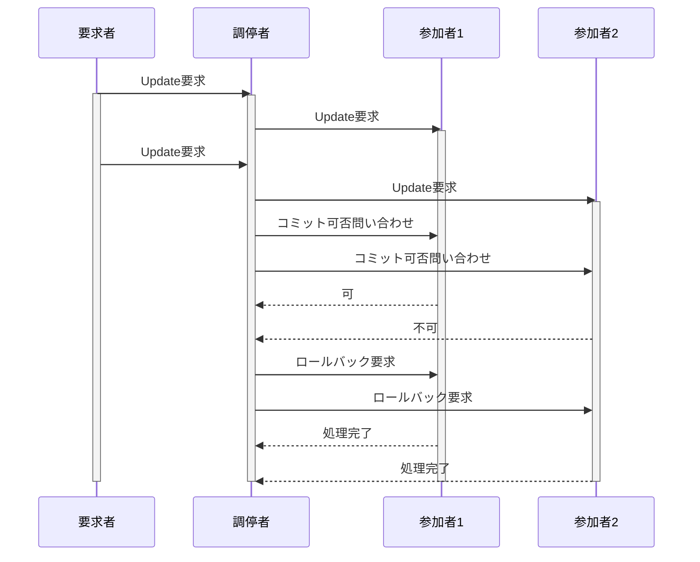

# 2相コミットプロトコル(Two-Phase Commit Protocol, 2PC)

## はじめに

2025年10月のプロジェクトマネージャ試験受験を終え、2026年春の情報処理安全確保支援士に向けて勉強中です。  
本記事を含めた各知識のインデックスや学習の道のりについては、「[情報処理安全確保支援士への道のり(随時更新中)](https://qiita.com/teppei19980914/items/6411cb70f2937cbefdcc)」をご参照ください。  
**本記事は学習した内容を記載しています。**  

## 該当問題

[情報セキュリティスペシャリスト平成27年春期 午前Ⅱ 問21](https://www.sc-siken.com/kakomon/27_haru/am2_21.html)  

## 2相コミットプロトコルとは

### 定義(エビデンス：Gray & Reuter, Transaction Processing/ISO/IEC)

**2相コミットプロトコル(2PC)**とは、**分散トランザクションにおいて、複数の参加ノード(参加者)がすべて同じ判断(コミット or アボート)を行うことを保証するためのコミット制御プロトコル**です。  
目的は、**分散環境でも「トランザクションの原子性」を保証すること**です。  

## 分散トランザクションと課題

### 単一DBとの違い

| 単一データベース | 分散データベース |
|---|---|
| ローカルログで制御可能 | 複数ノードの協調が必要 |
| 障害範囲が限定 | ネットワーク障害が発生 |
| COMMITは一箇所 | COMMIT判断を揃える必要 |

→ **「一部だけ更新される」状態が最も危険**

## 2相コミットの基本構造

### 登場人物

| 役割 | 説明 |
|---|---|
| コーディネータ(Coordinator) | トランザクション全体を管理 |
| 参加者(Participant) | 各データベース／ノード |

## 2相コミットの処理手順(最重要)



### 第1相：準備フェーズ(Prepare Phase)

1. コーディネータが各参加者に **「コミット可能か？」** を問い合わせ
2. 各参加者は以下を実施  
   - 更新内容をログに書き込み(Undo/Redoログ)
   - ロックを保持したまま  
   - **Yes(準備完了) or No(不可)** を返信

→ この時点では **まだ確定していない**

### 第2相：確定フェーズ(Commit Phase)

#### 全参加者が Yes の場合

1. コーディネータが **COMMIT 指示**
2. 各参加者がコミット実行
3. ロック解放

#### 1つでも No があった場合

1. コーディネータが **ABORT(ROLLBACK)指示**
2. 各参加者がロールバック
3. ロック解放

→ **全体で必ず同じ結果になる**

## 状態遷移の整理

```text
初期状態
   ↓
準備中(Prepare)
   ↓ Yes
コミット待ち
   ↓ Commit指示
確定(Commit)
```

No が出た場合は Abort に遷移します。  

## 2相コミットが保証する性質

| 特性               | 2PCでの扱い  |
| ---------------- | -------- |
| 原子性(Atomicity)   | ◎ 保証     |
| 一貫性(Consistency) | DB側制約に依存 |
| 独立性(Isolation)   | ロックにより保証 |
| 永続性(Durability)  | ログにより保証  |

**中でも原子性を担保する仕組みです。**  

## 障害発生時の挙動

### 参加者障害

* 再起動後、ログを参照  
* コミット済／未確定を判断可能  

### コーディネータ障害

* 参加者は 「コミットかアボートか分からない状態」 になる  
* ロックを保持したまま待機  

## 2相コミットの問題点

### ブロッキング問題(Blocking Problem)

* コーディネータ障害時  
* 参加者が永久に待たされる可能性  

### 性能低下

* 通信回数が多い  
* ロック保持時間が長い  

## 改良方式/関連知識

### 3相コミット(Three-Phase Commit)

* 2PCの欠点を軽減  
* ただし実装が複雑  

### 分散トランザクション代替手法

* Sagaパターン(補償トランザクション)  
* Eventually Consistent な設計(NoSQL)  
