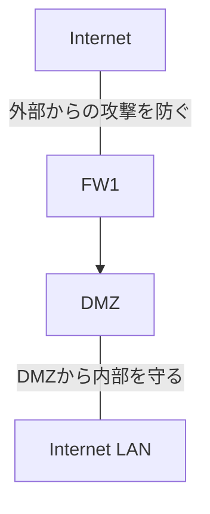

# DMZと内部インターネット構成の重要性

## はじめに

2025年10月のプロジェクトマネージャ試験受験を終え、2026年春の情報処理安全確保支援士に向けて勉強中です。  
本記事を含めた各知識のインデックスや学習の道のりについては、「[情報処理安全確保支援士への道のり(随時更新中)](https://qiita.com/teppei19980914/items/6411cb70f2937cbefdcc)」をご参照ください。  
**本記事は学習した内容を記載しています。**  

## 該当問題

[平成21年秋期試験問題　午前Ⅱ 問5](https://www.sc-siken.com/kakomon/21_aki/am2_5.html)  

## DMZ(非武装地帯：Demilitarized Zone)

外部ネットワーク(インターネット)からアクセスされる必要があるサーバ群を配置する「隔離されたネットワーク領域」です。  
つまり、外部に公開しなくてはいけないサーバ(DNS/Web/メール)を社内LANとは分離して配置する場所のことを指しています。  

### なぜDMZが必要なのか

侵害されたときの被害拡大を防ぐためです。  
もし公開サーバーを社内LANに配置し、公開サーバ内に攻撃者が侵入した場合、即座に社内ファイルサーバや端末が次々に感染してしまいます。  
これを防ぐために、DMZが存在します。  



## DNSサーバ

ドメイン名(例：example.com)をIPアドレスに紐づけて管理しています。  
用途は下記2つです。  

1. 権威DNSサーバ(Authoritative DNS)  
2. キャッシュDNS(リゾルバ)  

### 権威DNSサーバ

該当ドメインの公式情報を持つDNSです。  
インターネットから問い合わせが来るため、基本的にDMZに配置します。  

### キャッシュDNS

社内PCのDNS問い合わせを外部へ中継します。  
社内PCからの問い合わせしかなく、外部(DMZ)に配置すると危険が増すため、社内LANに配置します。  

## DNSキャッシュポイズニング

攻撃者が偽のDNS応答をキャッシュDNSに信じ込ませ、正規のドメインを攻撃者のIPに誘導する攻撃です。  
例えば本来、

```TEXT
www.bank.com → 198.51.100.10（正規サイト）
```

であるべきが、DNSキャッシュポイズニングによって、

```TEXT
www.bank.com → 203.0.113.66（攻撃者の偽サイト）
```

と解決してしまいます。  
ユーザは正規のサイトと信じているわけですから、偽サイト上でユーザIDやパスワードを入力し、攻撃者に窃取されてしまうわけです。  

### DNSキャッシュポイズニングが発生する仕組み

DNSには応答の正当性を検証する仕組みがありません。  
DNS問い合わせは次の情報だけで識別されます。  

* トランザクションID(16bit = 65536通り)  
* 送信元ポート(以前は固定53番)  
* クエリ内容(www.example.com)  

上記から攻撃者は下記のようなリクエストを大量に送り付けます。  

```TEXT
Your query for www.bank.com is here.
Transaction-ID: 12345
Answer: www.bank.com → 攻撃者のIP
```

上記リクエストのタイミングとIDが一致すれば、偽のIPアドレスがキャッシュされてしまいます。  

### DNSキャッシュポイズニングの影響

DNSはインターネットの住所録なので、改ざんされると全ユーザが攻撃されてしまう極めて深刻な攻撃です。  

* フィッシング誘導(偽サイトへ)  
* マルウェア配布サイトへ誘導  
* VPNやメールサーバの偽装  
* 社内の全通信を攻撃者の中継点へ転送(MITM攻撃)  

### DNSキャッシュポイズニング対策

下記5つがあります。  

1. 送信元ポートランダム化  
2. トランザクションIDのランダム化  
3. DNSSEC  
4. キャッシュDNSを外部公開しない  
5. DMZ + 内部LANの正しい構成  

#### 送信元ポートランダム化

以前はDNSクエリ送信元ポートが53番固定だったので、容易に推測できました。  
現在は 1024〜65535 のランダムポートを使用することで難度が大幅に上昇しています。  

#### トランザクションIDのランダム化

IDを予測できない乱数にします。  

#### DNSSEC

DNS応答にデジタル署名を付与する仕組みです。  
権威DNSが署名し、リゾルバが公開鍵で検証します。  
これにより、攻撃者が偽レコードを送っても署名検証に失敗し、キャッシュされません。    
**キャッシュポイズニングを本質的に解決する技術です。**  

#### キャッシュDNSを外部公開しない

オープンリゾルバ(Open Resolver)は攻撃の対象となります。  
そのため、外部公開しないことが極めて重要です。  

#### DMZ + 内部LANの正しい構成

「権威DNSをDMZ」に配置し、「キャッシュDNS」は内部LANに配置する構成が最も安全です。  

## 周辺知識

### リカージョン(Recursion)

キャッシュDNSが外部に問い合わせする操作です。  
通常、権威DNSはリカーシブ応答をしません。  

### フォワーダ設定

キャッシュDNSが上位DNSへ問い合わせを委任する仕組みです。  
企業では ISP のDNSをフォワーダにするのが一般的です。  

### DNSアンプ攻撃(DDos攻撃)

Open Resolverが反射攻撃に悪用される攻撃です。  

### Split DNS

内部用と外部用で異なるDNSを用いる技術です。  

### ISP(Internet Service Provider)

利用者をインターネットに接続するための通信サービスを提供する事業者のことです。  
