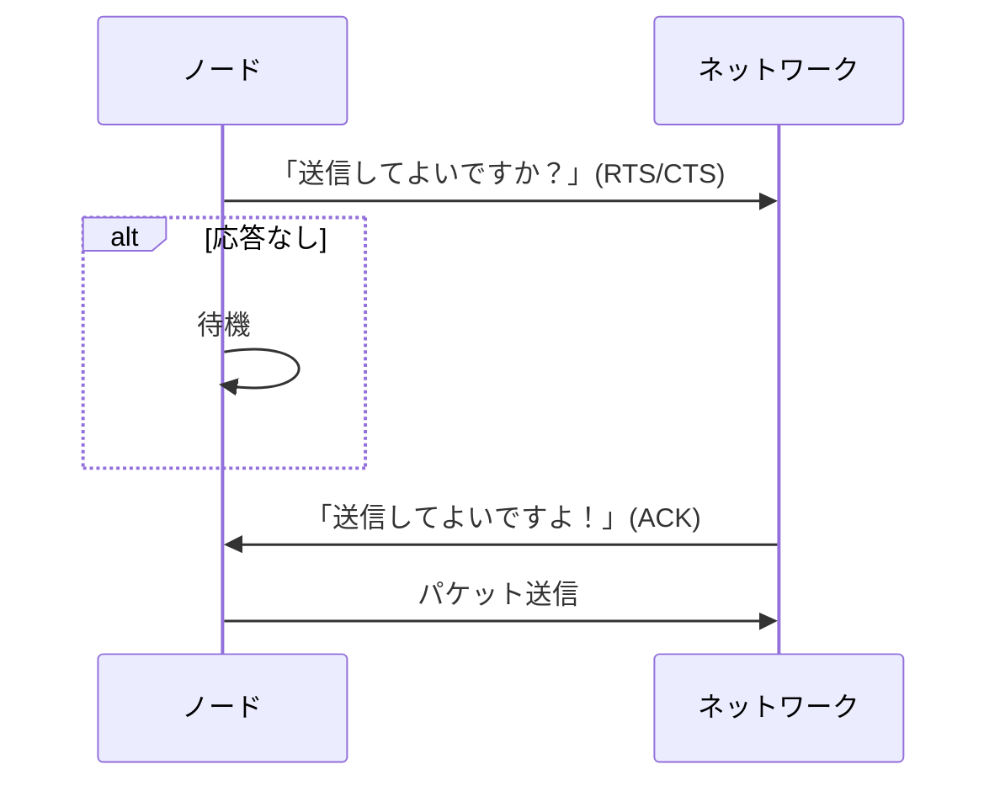

# LANの制御方式

## はじめに

2025年10月のプロジェクトマネージャ試験受験を終え、2026年春の情報処理安全確保支援士に向けて勉強中です。  
本記事を含めた各知識のインデックスや学習の道のりについては、「[情報処理安全確保支援士への道のり(随時更新中)](https://qiita.com/teppei19980914/items/6411cb70f2937cbefdcc)」をご参照ください。  
**本記事は学習した内容を記載しています。**  

## 該当問題

[情報セキュリティスペシャリスト平成25年秋期 午前Ⅱ 問17](https://www.sc-siken.com/kakomon/25_aki/am2_17.html)  
[情報処理安全確保支援士平成31年春期 午前Ⅱ 問18](https://www.sc-siken.com/kakomon/31_haru/am2_18.html)  

## LANの制御方式

複数端末が同じネットワーク媒体を共有するLAN上では、複数端末が同時に送信することで衝突(コリジョン)が発生してしまいます。  
そのため、「誰が、いつ、どのように送信するのか」を決める仕組みが必要であり、この仕組みがLANの制御方式(MAC方式(Media Access Control))です。  

### 主要なMAV制御方式

* CSMA/CD  
* トークンパッシング  
* CSMA/CA  

#### CSMA/CD(Carrier Sense Multiple Access with Collision Detection)

送信前に回線が空いているか(キャリアセンス)を確認し、データを送信します。  
もし仮に、コリジョンが発生した場合は、再送する方式です。  

##### コリジョンの検出

送信中の端末は、自身の送信信号と回線上に流れている信号を比較し、他端末との信号が混じって波形が崩れた場合、衝突の発生と判断します。  
**上記検出方法は有線(Ethernet)だからこそ可能ですが、無線LANの場合は不可能なので、CSMA/CAが存在します。**  

#### トークンパッシング(Token Bus/Token Ring)

「トークン」と呼ばれるネットワーク上の特殊フレームが順番にノードを巡回し、トークンを持ったノードだけが送信できる方式です。  
トークンを保持しているノードはその瞬間は世界に一つだけなので、同時送信が起こらず衝突が発生しません。  

##### メリット

* 衝突ゼロ  
* 優先度制御が可能（トークンの回り方を制御）  
* リアルタイム性が要求される産業ネットワークに適する  

##### デメリット

* トークンが失われると送信不能  
* 物理構成・復旧が複雑  
* スイッチEther 化で事実上廃れた  

#### CSMA/CA(Carrier Sense Multiple Access with Collision Avoidance)

有線LANのように衝突を検出できない無線環境で、事前に衝突を避ける(Avoidance)方式が必要です。  

##### 衝突を避ける仕組み

無線上で送受信間による送信可否応答を行っています。  

1. RTS/CTS(送信要求／クリア通知)  
2. 送信前にランダム待機(バックオフ)  
3. ACK を受け取るまで次を送らない

### 隠れ端末問題

CSMA/CAでは、各端末が互いに送信フレームを受信できることが前提になっています。  
しかし、2つの端末間の遮蔽物や位置関係によっては送信フレームを受信できないことがあります。  
この時、互いに他方の端末の送信を検知できないことになるため、同時送信による衝突が起こりやすくなります。  
これを各連松問題と呼びます。  

## 周辺知識

### スイッチングハブ(Layer2 Switch)

これによって、CSMA/CDの役割を終えました。  

* MACアドレス学習  
* 衝突ドメインの分離  
* 全二重通信(コリジョンなし)  

### VLAN(Virtual LAN)

* 仮想LAN  
* ブロードキャストドメインを分割  
* セキュリティ向上に必須  

### Spanning Tree Protocol(STP)

* ループ防止  
* BPDUによるルートブリッジ選定  

### 無線LANの周辺知識

* WPA2/WPA3  
* AES-CCMP  
* マネージャフレーム保護(802.11w)  
* DFS(レーダー干渉回避)  

### QoS(Quality of Service)

* 優先度制御(Voice/Video)  
* Token Passing時代の優位性をEthernetが取り込んだもの  
